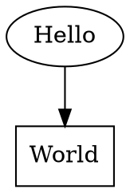

# sane-graph-edit

A keyboard-driven desktop editor for small [Graphviz
DOT](https://graphviz.org/doc/info/lang.html) graphs. Double-click to
spawn nodes, hit `v`/`e` to connect them, drag to move, wheel to zoom,
`Ctrl+S` to save. That's most of it.

The goal is **"text-editor ergonomics for graphs"**: no palettes, no
menus to fight, no mouse round-trips. You can draft a tree or a
dependency graph roughly as fast as you can describe it out loud.

Written in Kotlin + Swing, runs anywhere JDK 21 runs.

## Status

Being revived from a long-dormant "forgotten changes" state.
Buildable, runnable, but rough around the edges. See
[`tasks/roadmap.md`](tasks/roadmap.md) for the plan and
[`docs/developer/architecture.md`](docs/developer/architecture.md) for
the code-level picture.

## Build & run

You need a JDK 21 (or newer — the toolchain is set to 21). Everything
else comes from Gradle.

```sh
./gradlew run            # launch the editor
./gradlew build          # compile + test + assemble
./gradlew fatJar         # build/libs/sane-graph-edit-<v>-all.jar
```

Then `java -jar build/libs/sane-graph-edit-*-all.jar` to run the fat
jar on a machine without Gradle.

## Using it

### Mouse

| Action                       | What it does                                       |
|------------------------------|----------------------------------------------------|
| Click a node                 | Select it (replaces current selection)             |
| `Ctrl` + click node          | Toggle that node in/out of the multi-selection     |
| `Ctrl` + click empty + drag  | Selection box — rubber-band adds to selection      |
| Drag a selected node         | Move the selection                                 |
| Drag on empty space          | Pan the view                                       |
| Double-click empty           | Create a new node                                  |
| Double-click a node          | Edit its text in place                             |
| Right-click                  | Open the colour / shape / size picker on hover node |
| Mouse wheel                  | Zoom in / out, centred on the cursor               |

### Keyboard — structural edits

| Key       | Action                                                          |
|-----------|-----------------------------------------------------------------|
| `e` / `E` | Connect selection → node under cursor (forward / backward)      |
| `v` / `V` | Spawn new node at cursor, connect from selection (fwd / bwd)    |
| `a` / `A` | Append new node + edge from the last active node                |
| `c`       | Clear edges (within selection, or incident to selection)        |
| `d`       | Delete selected nodes                                           |
| `D`       | Delete selected nodes but reconnect predecessors to successors  |
| `o` / `O` | Run layout optimiser (free / restricted around the drag node)   |
| `g`       | Toggle "grab" mode — move the selection without holding a button |

### Keyboard — selection & navigation

| Key        | Action                                                    |
|------------|-----------------------------------------------------------|
| `Ctrl+A`   | Select all / deselect all (toggle)                        |
| `Escape`   | Clear selection                                           |
| `t` / `T`  | Add the forward / backward reachable closure to selection |
| `l` / `L`  | Add one generation of neighbours (forward / backward)     |
| `w` / `W`  | Remove the "oldest" generation of the current selection   |
| `0`        | Fit view to all nodes (or to selection if any)            |
| `1`        | Centre view on selection                                  |
| `Space`    | Edit the text of the last active node                     |
| `Shift+Space` | Same, but replace selection with that node first       |

### Keyboard — styling

| Key        | Action                                                    |
|------------|-----------------------------------------------------------|
| `F`        | Copy style from the selected node to the "clipboard"      |
| `f`        | Paste the last-copied style onto the selected nodes       |

### Keyboard — history

| Key            | Action                                                  |
|----------------|---------------------------------------------------------|
| `u`            | Undo the last mutation                                  |
| `r` or `Ctrl+R`| Redo                                                    |

Undo covers every user-visible change: spawning / deleting nodes,
adding / removing edges, moving nodes (one step per drag, not per
pixel), typing into a node (one step per edit session, not per
keystroke), style / shape / size changes, and layout-optimiser runs.
Selection changes and view transforms are not tracked — they're
navigation, not data.

### Keyboard — files

| Key             | Action                                                 |
|-----------------|--------------------------------------------------------|
| `Ctrl+O`        | Open — file chooser dialog                             |
| `Ctrl+S`        | Save — writes to the current file, prompts on first save |
| `Ctrl+Shift+S`  | Save As — always prompts                               |
| `Ctrl+N`        | New tab                                                |

On close, the editor prompts Save / Discard / Cancel for every
unsaved tab. Last-used open/save directories are remembered in
`~/.sanegrapedit.properties`.

### Autosave backups

Every 5 minutes, any dirty tab is written to
`$XDG_CACHE_HOME/sane-graph-edit/backups/` (defaults to
`~/.cache/sane-graph-edit/backups/`) as a plain DOT file with
the filename

```
<basename>.<hash>.<id>.dot
```

where `basename` is the source file's name without its `.dot`
extension (or `untitled` for tabs that have never been saved),
`hash` is a short SHA-1 prefix of the absolute source path (or
the tab's autosave UUID for untitled tabs) to disambiguate files
that share a basename, and `id` is a monotonically increasing
integer per `(basename, hash)` pair. Examples:

```
foo.3a1b9cd0.1.dot
foo.3a1b9cd0.2.dot
foo.3a1b9cd0.3.dot
untitled.8e7d2f4a.1.dot
```

**Backups accumulate and are never deleted automatically.** The
design goal is a safety net against your own saving mistakes: if
you overwrite the wrong file, save after a bad delete, or
clobber a graph with an empty document, the previous snapshots
are still sitting in the backup directory. Recovery is manual —
`ls ~/.cache/sane-graph-edit/backups/`, find the snapshot you
want, copy it into place. When the directory gets too large,
prune it yourself.

The editor does **not** restore previously open tabs at startup
— every launch begins with a single empty tab.

### Keyboard — tabs

| Key                | Action                                               |
|--------------------|------------------------------------------------------|
| `Ctrl+T`           | Open a new empty tab                                 |
| `Ctrl+W`           | Close current tab (prompt if unsaved)                |
| `Ctrl+Tab`         | Next tab                                             |
| `Ctrl+Shift+Tab`   | Previous tab                                         |
| `Ctrl+PageDown`    | Next tab (alias)                                     |
| `Ctrl+PageUp`      | Previous tab (alias)                                 |

Each tab owns its own graph, file path, undo history, and view
transform (pan / zoom). Closing the last tab clears it rather than
removing it — the window is never empty.

### Keyboard — clipboard

| Key        | Action                                                   |
|------------|----------------------------------------------------------|
| `Ctrl+C`   | Copy selected nodes (plus edges with both endpoints in)  |
| `Ctrl+X`   | Cut — copy and delete                                    |
| `Ctrl+V`   | Paste under the cursor                                   |

The clipboard is process-local and works across tabs: copy in one
tab, switch tabs, paste. Pasted nodes become the new selection so
they can be immediately repositioned or restyled.

## File format

Native format is a subset of [Graphviz
DOT](https://graphviz.org/doc/info/lang.html):



Attributes the editor understands and round-trips:

- `label` — node text
- `pos` — node position (with the trailing `!` for fixed placement)
- `fillcolor` / `color` — background / foreground
- `fontsize` — maps to an internal scale factor
- `shape` — `box` or `oval`

Anything else (graph-level settings, unknown attributes, comments) is
preserved verbatim on open/save.

## Why "sane" graph edit?

Most graph editors assume you want to *compose* a diagram out of
prefab pieces on a palette. If you just want to write down "A leads
to B, B and C both lead to D, by the way D is the interesting one",
you end up fighting the editor. This tool skips the palette and makes
the common operations — spawn a node, connect it, label it, move it —
one keystroke each.

## Contributing / hacking

- [`docs/developer/architecture.md`](docs/developer/architecture.md)
  is the orientation document. Read it first.
- [`tasks/`](tasks/) holds the design plans for in-flight features.
- Top-level types (`Graph`, `Plotter`, `GraphView`, `GraphKeyListener`,
  `DotGraphLoader`) have KDoc pointing at the relevant sections.

## Licence

See [LICENCE](LICENCE) if present, otherwise ask the author. Code is
by Karel Tuček — the in-app help calls out
`github.com/kareltucek/saneGraphEdit`.
