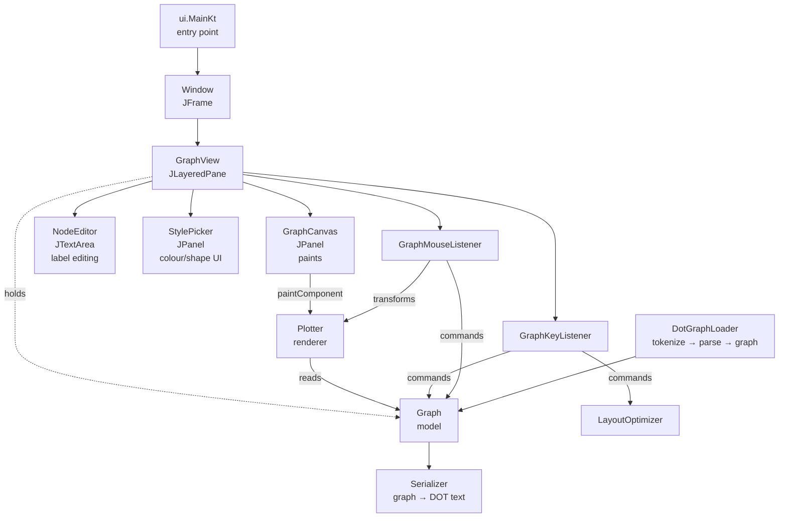
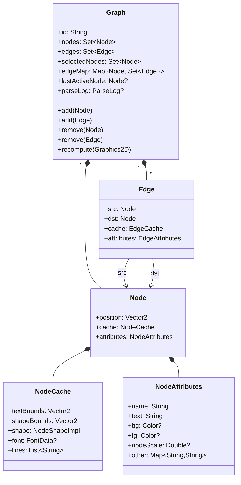
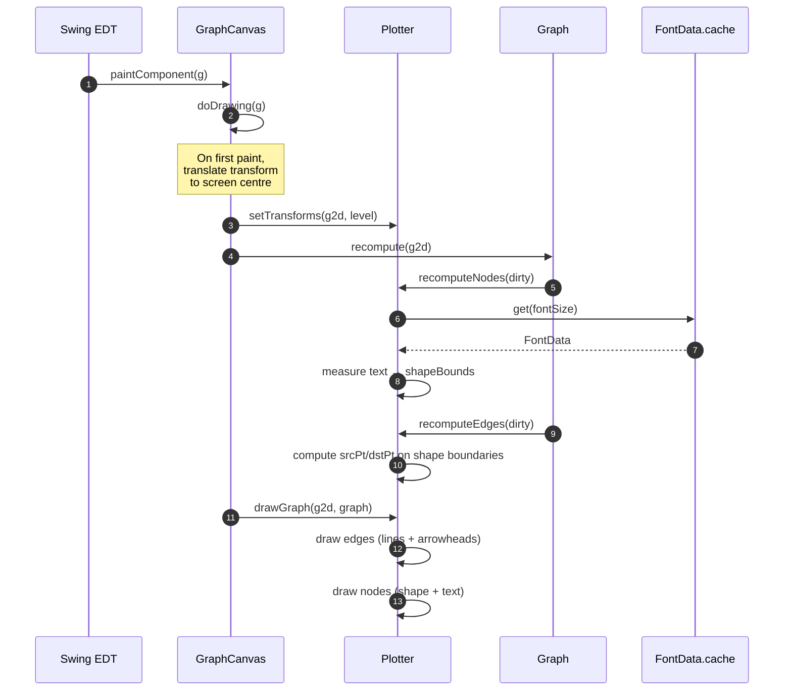
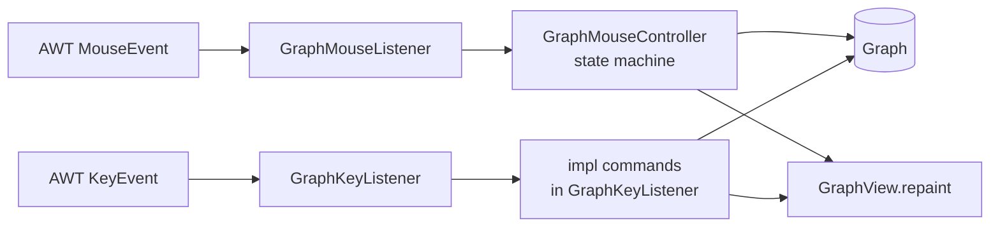
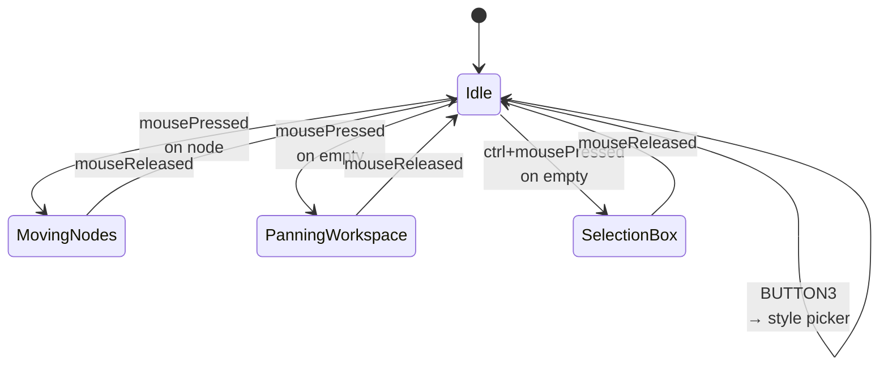
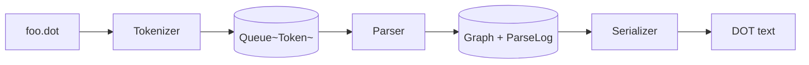

# Architecture

> Intended audience: future contributors (including future-me) who
> want to change code in this repo. This file is meant to be read
> top-to-bottom once, and then skimmed for specific sections. It
> lives under version control because it will age and need updates.

Diagrams are [Mermaid](https://mermaid.js.org/) and render in
Obsidian, GitHub, and most markdown viewers.

## The 30-second summary

`sane-graph-edit` is a **desktop graph editor** written in
**Kotlin + Swing**. You draw nodes by double-clicking, you connect
them with keyboard shortcuts (`e`, `v`, `a`), you pan with drag and
zoom with the wheel, and you save as [Graphviz
DOT](https://graphviz.org/doc/info/lang.html). That's the whole
product.

Under the hood there are four packages:

| Package        | Role                                               |
|----------------|----------------------------------------------------|
| `graph_tools`  | Data model (`Graph`, `Node`, `Edge`) + renderer (`Plotter`) + layout (`LayoutOptimizer`) |
| `parser_dot`   | DOT tokenizer, parser, serializer                  |
| `ui`           | Swing widgets + input handlers                     |
| `utils`        | `Vector2`, constants, small helpers                |

## Top-level component map



The arrow from `GraphCanvas` to `Plotter` is the **read-only
rendering path**. Every other arrow is a **mutation** or a
**handoff**.

## Data model



A few things worth calling out:

- **`cache` is derived state.** It stores layout measurements
  (bounds, font, line splits, edge endpoints) that the renderer
  depends on but are expensive to recompute. The contract is: after
  mutating a node's `attributes` or `position`, you call
  `Graph.needsRecomputing(node)`. The next `Graph.recompute(g2d)`
  call will refresh everything marked dirty. `GraphCanvas.doDrawing`
  calls `recompute()` on every paint — so you rarely need to think
  about it explicitly as long as you mark the dirty node.

- **Edge identity is referential.** `Edge` has no `equals`/`hashCode`
  overrides (there's commented-out code from a past attempt — see
  `Edge.kt:32-47`). Two edges with the same src/dst are distinct
  objects. This matters for undo (restoring removed edges needs the
  same object) and for allowing multi-edges.

- **`lastActiveNode` is both "cursor" and "anchor".** It tracks the
  most recently touched node so that keystrokes like `Space` (edit)
  and `a` (append with edge) know what to act on when the mouse
  isn't involved. It is not the same thing as a single selection.

## Rendering pipeline



### Coordinate systems

There are two:

- **Workspace** (world) — the logical graph coordinates stored in
  `Node.position`. Invariant across zoom/pan.
- **Screenspace** — AWT pixel coordinates inside `GraphCanvas`.

The mapping is a single `AffineTransform` stored at **`Plotter.t`**.
`utils/Utils.kt` has extension helpers:

- `MouseEvent.toWorkspaceVector()` — screen → world
- `Vector2.toScreenVector()` — world → screen

> ⚠️ **`Plotter.t` is currently a global.** This is fine for the
> single-graph editor, but once we add tabs it needs to be either
> saved/restored on tab switch or moved onto `GraphView`. See
> `tasks/tabs.md` for the plan.

### Font caching

Font measurement via `FontMetrics` is surprisingly expensive at
scale, and `Graphics2D`'s current transform leaks into metric
calculations — a zero or tiny transform corrupts measurements.

`FontData.cache` (in `Plotter.kt:175+`) keeps font-metric entries
keyed by font size (a `Double`). Every lookup wraps the metric
calculation in `g2d.withIdentityTransform { … }` so the measurement
is always taken at "scale 1". The bug that motivated this cache is
memorialised in commit `5e1e2f4`.

### Optimisation levels

`GraphCanvas.optimizeLevel` starts at 0. If a frame takes longer
than `50 + 50 * level` ms (see the `withPerformanceCheck` wrapper in
`utils.Utils.PerformanceData`), the level bumps up and the next
frame drops features:

| Level | What it drops                                    |
|-------|--------------------------------------------------|
| 0     | nothing                                          |
| 1     | antialiasing during pan                          |
| 2     | antialiasing even while still                    |
| 3     | arrowhead ovals (draws plain squares)            |
| ≥3    | text rendering below a zoom threshold (see `drawNode`) |

There's no "undo" for the level — once bumped, it stays up.

## Input handling



### `GraphMouseController` states



### Keyboard commands

`GraphKeyListener.impl.executeCommand(String, GraphView)` is a
giant `when` that maps single-character commands to actions. The
canonical list:

| Key    | Action                                                 |
|--------|--------------------------------------------------------|
| `e`/`E`| draw edge from selection to node under cursor (fwd/bwd) |
| `v`/`V`| new node + edge from selection                         |
| `a`/`A`| append new node + edge from last active                |
| `c`    | clear edges                                            |
| `d`/`D`| delete (with/without reconnect)                        |
| `o`/`O`| layout optimise                                        |
| `t`/`T`| select reachable closure (forward/backward)            |
| `l`/`L`| select one generation of neighbours                   |
| `w`/`W`| unselect oldest generation                             |
| `f`/`F`| paste/copy node style                                  |
| `u`    | undo the last mutation                                 |
| `r`    | redo the last undone mutation                          |
| `g`    | toggle "grab and move" state                           |
| `0`    | fit view to all / selection                            |
| `1`    | centre view on selection                               |

Ctrl-modified shortcuts go through `keyPressed` instead of
`keyTyped`: `Ctrl+S` save, `Ctrl+O` open, `Ctrl+R` redo, `Ctrl+A`
select-all, `Escape` deselect, `Space` edit active node.

See `Constants.helpCommands` for the in-app help text.

## DOT parsing / serialization



The tokenizer and parser are hand-written, not generated. Key
files:

- `parser_dot/Tokenizer.kt` — produces `Token(TokenType, value)`
- `parser_dot/Parser.kt` — consumes tokens, emits `Graph`
- `parser_dot/ParseLog.kt` — records `LogAction`s (comments,
  section breaks, node/edge declarations) so that the serializer
  can produce output that preserves structure on round-trip
- `parser_dot/Serializer.kt` — walks the `ParseLog` to emit DOT,
  with fallbacks for newly-added graph content not in the log
- `parser_dot/DotGraphLoader.kt` — top-level façade + file IO +
  an embedded ad-hoc test in `object Test`

Supported node attributes (round-trip fidelity):

| DOT attribute | `Node` field                |
|---------------|-----------------------------|
| `label`       | `attributes.text`           |
| `fillcolor`   | `attributes.bg`             |
| `color`       | `attributes.fg`             |
| `pos`         | `position` (with trailing `!`) |
| `fontsize`    | derived into `nodeScale`    |
| `shape`       | `cache.shape` (oval / box)  |

Everything else ends up in `NodeAttributes.other` and round-trips
verbatim.

## Layout optimiser

`graph_tools/LayoutOptimizer.kt` is a force-directed layout.
One pass gathers three kinds of spring force, averages them per
node, and applies one position update:

| Spring        | Function                  | Fires on       | Effect                                         |
|---------------|---------------------------|----------------|------------------------------------------------|
| **BB**        | `computeBBSpring`         | each edge      | Pulls both endpoints toward a target distance derived from the nodes' shape boundaries. "BB" = bounding-box boundary. |
| **Collision** | `computeCollisionSpring`  | every node pair | Pushes apart pairs closer than `sum-of-radii × distanceCf × springScale`. Keeps unconnected nodes from stacking.     |
| **Gravity**   | `computeGravitySpring`    | each node with in-edges | Aligns a node with the direction of its incoming edges. Keeps chains of edges pointing consistently.        |
| **Uniform-out** | `computeUniformOutSprings` | each node with ≥ 2 outgoing edges | Pulls the destinations toward the average outgoing-edge length along their current radial direction. Sibling edges settle to the same length. |

`compute()` flattens the three lists, groups by target node,
averages the per-node vector, and adds it to the position. One
call = one nudge.

**`springScale`** (session-wide, tuneable with `-`/`=`)
multiplies both the BB target distance and the collision
threshold, so the whole graph breathes together when the user
adjusts it. Collision threshold is floored at `1.0 × sum-of-radii`
so nodes can touch but not overlap regardless of scale.

**`SpringTarget`** controls *which* nodes get moved. Empty
selection relaxes everything (`MoveEveryone`); non-empty
selection relaxes only the selected nodes (`MoveSelectedOnly`)
but still considers cross-boundary edges as pulls on the
selected end. See `SpringTarget.fromContext` for the full
decision table.

Triggered by:

- `o` / `O` keybinding — one-shot layout pass (same result
  for both after the anchor fix).
- `-` / `=` — adjust `springScale`, then one pass.
- `optimizeOnDrag` flag — layout every mouse-move event while
  dragging.

Good for tidying a graph you've hand-drawn, not for producing a
canonical layout from scratch. Collision is O(n²) per pass —
fine for hundreds of nodes, slow for thousands.

## Undo / redo

`graph_tools/History.kt` defines a `Command` interface and a bounded
stack; `graph_tools/Commands.kt` holds the concrete commands
(`AddNodeCommand`, `RemoveEdgesCommand`, `MoveNodesCommand`,
`EditTextCommand`, `StyleNodesCommand`, `SetShapeCommand`,
`SetSizeCommand`, plus `CompositeCommand` for grouping). Each
`Graph` owns one `History` instance, so a per-graph (and
eventually per-tab) undo stack falls out naturally.

Rule of thumb when adding a new mutation:

1. Write a `Command` that holds the before/after state.
2. Call `graph.commit(cmd)` (runs redo + pushes to stack) for
   instantaneous mutations, or `graph.history.commitWithoutRun(cmd)`
   for mutations that happen live during a user gesture (like node
   drag — the positions are already updated by the time you commit).
3. Leave the low-level mutators on `Graph` (`add`, `remove`,
   `addAllEdges`) alone: they stay off-the-record so the DOT parser
   can populate a fresh graph without spamming the history.

Drag coalescing is a "per-gesture transaction", not time-windowed:
`GraphMouseController` snapshots positions on `startMove*` and
commits once on release. Text edits coalesce within a 1-second
window by `EditTextCommand.coalesceInto`.

## Tabs and file handling

`ui/TabManager.kt` owns a `JTabbedPane` and the list of open
`GraphView`s. Each tab is one document: its own `Graph` (so its
own undo stack), its own `currentFile: Path?`, its own
`isDirty: Boolean`, and its own `viewTransform: AffineTransform`.
On tab switch, `TabManager.onChanged` reassigns the `Plotter.t`
global reference to the active view's transform — same pattern as
"the active terminal has stdin/stdout".

Closing the last tab resets it to an empty untitled document
rather than removing it, so the window is never empty. Closing
the window walks every tab and prompts Save / Discard / Cancel
for each dirty one before letting the process exit.

`ui/FileOps.kt` wraps `JFileChooser` for open and save-as dialogs.
`ui/AppState.kt` stores the last-used open and save directories
in `~/.sanegrapedit.properties` so dialogs start somewhere useful.

Cross-tab copy/paste uses a process-global `ui.Clipboard` holding
a `NodeFragment` (cloned nodes + edges where both endpoints are
in the selection + reference point for paste positioning). Paste
commits a `CompositeCommand(AddNodesCommand + AddEdgesCommand)`
so it's undoable.

### Session persistence

`ui/Session.kt` persists the ordered list of file-backed tabs
and the active tab path to
`$XDG_CONFIG_HOME/sane-graph-edit/session.properties` (via
`ui/XdgPaths.kt`). `TabManager.bootstrap()` reads it at startup
and reopens every file that still exists and parses; failures
are skipped with a stderr warning. `TabManager.saveSession()` is
called on tab open/close/save and on window close.

Untitled tabs are intentionally omitted from the session — there
is no stable identifier to restore them from, and their
in-flight work is a different problem (see autosave backups,
below). The restore path only reopens files *from disk*; it
never touches the backup directory.

### Autosave backups

`ui/AutosaveManager.kt` runs a daemon `Timer` every 5 minutes
(`DEFAULT_INTERVAL_MS`) that writes every dirty `GraphView` to
`$XDG_CACHE_HOME/sane-graph-edit/backups/` (via `ui/XdgPaths.kt`)
as a plain DOT file with the name

```
<basename>.<hash>.<id>.dot
```

- `basename` is `currentFile.fileName` with the `.dot` suffix
  removed, or `untitled` for tabs that have never been saved.
- `hash` is the first 8 hex chars of `SHA-1(absolute source
  path)` for file-backed tabs, or the first 8 chars of the
  tab's autosave UUID for untitled tabs.
- `id` is a monotonically increasing integer per
  `(basename, hash)` prefix, allocated by `BackupIdAllocator`.

Filename construction lives in the pure `BackupPaths` object
(`basenameFor`, `hashFor`, `prefixFor`, `filenameFor`,
`parseFilename`) so tests can exercise the scheme without a tab
manager. `BackupIdAllocator` owns the counter state: it seeds
itself lazily by scanning the backup directory for existing
snapshots on the first lookup for a given prefix, so ids keep
climbing across editor restarts.

**Backups are never deleted automatically.** There is no
`deleteBackup` method, no cleanup on save, no cleanup on tab
close. The design goal is an accumulating safety net against
the user's own saving mistakes; pruning is the user's job.
Recovery is likewise manual — find the desired `.dot` file
under `~/.cache/sane-graph-edit/backups/` and copy it into
place. The two persistence layers are intentionally separate:
session restore reopens *files*, backups hold *content
snapshots*, and neither automatically crosses into the other's
job.

All IO in this path is best-effort: a failing backup write (disk
full, permission denied) never kills the editor, and a missing
backup directory is treated as empty rather than an error.

## What is *not* in the box

Items currently missing and planned under `tasks/`:

- **SVG export** — no export at all. See `tasks/svg-export.md`.
- **Broader test coverage** — we have unit tests for history and
  the clipboard (`src/test/kotlin/`), but the renderer, the input
  layer, and the DOT parser still rely on manual testing.

## Gotchas and legacy quirks

- **`Graph.findEdge` is O(n)** (`Graph.kt:144` has a
  `// todo: optimize this!`). For the graph sizes this tool targets
  (<1000 nodes) it's fine.
- **`GraphMouseListener` has a `// Todo: refactor this!`** at the
  top. The file is 312 lines of state-machine-by-convention.
  Leave it alone until there's a concrete reason to touch it; an
  input refactor is its own project.
- **`Graph.testGraph()`** still exists as a seed fixture but no
  longer runs on startup — fresh tabs are empty. Useful for
  manual inspection and for tests.
- **`Plotter.t` is still a singleton variable**, but now points
  at the active tab's `GraphView.viewTransform`. `TabManager`
  rewires it on every tab switch. A future cleanup would thread
  the transform through draw calls explicitly; for now, the
  invariant is "`Plotter.t === tabManager.current.viewTransform`
  at all times outside the split-second window during a tab
  switch".

## Where to start when making changes

1. Running the editor: `./gradlew run`.
2. Changing input behaviour: `GraphKeyListener.impl` or
   `GraphMouseController`.
3. Changing how things look: `graph_tools/Plotter.kt` (renderer) or
   `graph_tools/NodeShape.kt` (shape primitives).
4. Changing what gets saved: `parser_dot/Serializer.kt` + the
   `applyAttribute` / `retrieveAttributes` pair in `Node.kt`.
5. Changing the window layout: `ui/GraphView.kt` (it's the
   `JLayeredPane` holding canvas, editor, and style picker).
